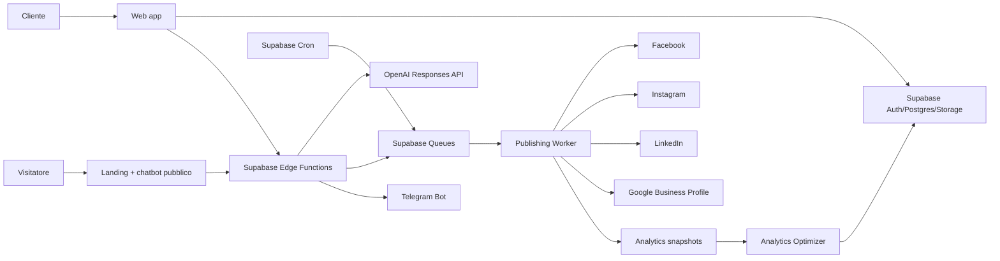

# Architecture

## Componenti

## Frontend

Lovable viene usato una volta per design system, landing, onboarding, dashboard e shell delle pagine. Dopo il bootstrap il codice vive in GitHub e viene modificato direttamente. Nessun secret nel bundle frontend.

## Backend

Supabase è il backend principale. Edge Functions gestiscono OAuth callback, webhook, orchestrazione AI, publishing e operazioni privilegiate. PostgreSQL conserva dati tenant-scoped, memoria editoriale, job e analytics. Storage conserva asset in path tenant-scoped.

## Multi-tenancy

Ogni risorsa cliente ha `tenant_id`. `tenant_members` determina appartenenza e ruolo. Le policy RLS usano helper server-side. Il browser non è mai fonte autorevole del tenant: ogni funzione deriva/valida il tenant rispetto a `auth.uid()`.

## Queue e scheduler

Cron inserisce piccoli batch di job nella queue. I worker acquisiscono job con visibility timeout, verificano idempotency key ed eventuale `external_post_id`, pubblicano e registrano ogni attempt. Errori AUTH/VALIDATION non vengono ritentati come RATE_LIMIT/RETRYABLE.

## AI

Un `AIOrchestrator` chiama moduli logici: brand intelligence, competitor intelligence, strategy, topic research, copy, platform optimization, GBP local optimization, visual direction, QA/fact-check, anti-duplicate, scheduling e analytics optimization. Il `AIModelRouter` seleziona il modello in base a task/costo/rischio. Modelli configurati da DB/env, mai sparsi nel codice.

## Chatbot

Il chatbot pubblico usa esclusivamente knowledge di prodotto pubblica. Quello autenticato può usare knowledge di prodotto + dati del tenant autorizzato. I due retrieval scope restano separati.

## Environments

`development` → publishing reale OFF di default.
`staging` → account social di test/limitati e feature flag.
`production` → publishing abilitabile per tenant/provider.