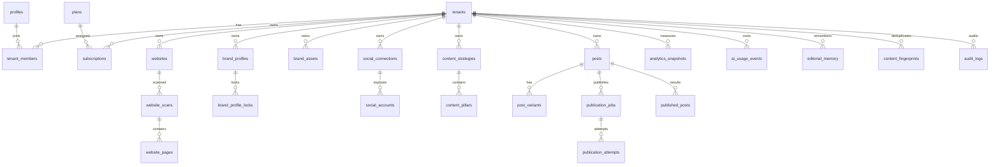

# Database

## Stato

**VALIDATO LOCALMENTE — 2026-08-09**

La foundation gira su Supabase locale tramite CLI + Docker e viene ricostruita da database vuoto in CI. Nessuno dei due progetti Supabase cloud già esistenti viene usato per questo SaaS.

## Comandi locali

Prerequisiti: Docker e Supabase CLI.

```bash
supabase start
supabase db reset --local
supabase migration list --local
supabase db lint --local --level warning --fail-on error
supabase db advisors --local --type security
supabase db advisors --local --type performance
supabase test db --local
```

`supabase/seed.sql` contiene esclusivamente fixture locali non sensibili. Gli utenti Tenant A/Tenant B vengono creati dinamicamente dai test e rimossi a fine suite.

## Migration history locale validata

1. `20260809193000_001_tenancy_foundation.sql`
2. `20260809194000_002_core_domain.sql`
3. `20260809195000_003_prompt_support_storage.sql`
4. `20260809200000_004_tenant_consistency.sql`
5. `20260809201000_005_quota_engine.sql`
6. `20260809202000_006_local_validation_fixes.sql`

La sesta migration deriva da problemi reali trovati dalla prima esecuzione locale: grant server-side mancanti, extension `vector` nello schema `public` e tre policy segnalate dai Performance Advisors.

## ERD iniziale



## Isolamento multi-tenant

Il modello non si affida soltanto a una colonna `tenant_id`:

- RLS su tutte le tabelle applicative `public`;
- membership/role helpers server-side;
- foreign key composte `(tenant_id, id)` sulle relazioni sensibili;
- tabelle service-only senza grant di scrittura ad `authenticated`;
- schema `app_private` senza `USAGE` per `anon`/`authenticated`;
- test reali con due utenti Auth e due tenant separati.

Il test applicativo copre SELECT, INSERT, UPDATE e DELETE cross-tenant e un tentativo di collegamento FK verso un parent di un altro tenant.

## Sicurezza dati

- `service_role` non viene mai usata nel frontend.
- La migration 006 assegna a `service_role` i grant PostgreSQL necessari alle operazioni trusted server-side; tali grant non vengono propagati ai ruoli client.
- Credenziali social sono conservate in `app_private.integration_credentials` esclusivamente come ciphertext/metadata; la cifratura applicativa autenticata viene implementata prima dell'OAuth reale.
- `platform_admins` è nello schema privato.
- Extension `vector` vive nello schema `extensions`, non in `public`.
- I tre bucket applicativi sono privati.

## Quota engine

Il flusso trusted è:

```text
reserve_tenant_usage
  -> commit_tenant_usage
  oppure
  -> release_tenant_usage
```

La reservation contiene una `idempotency_key`. I test locali verificano replay di reserve/commit/release, limiti e contatori `used`/`reserved`. Le RPC di mutazione quota non sono eseguibili da `anon` o `authenticated`.

## Knowledge

Due livelli:

1. RAW: `website_pages`, asset, documenti e snapshot.
2. COMPACT: `brand_context_versions`, usato nella maggior parte delle generazioni.

## Publishing

`publication_jobs.idempotency_key` è unico per tenant. `published_posts` conserva l'ID esterno. Il worker deve controllare entrambi prima di una chiamata provider.

## Validazione CI

Workflow: `.github/workflows/tenant-isolation.yml`.

Ultimo ciclo database di riferimento del 2026-08-09:

- `supabase start`: PASS;
- `supabase db reset --local`: PASS;
- migration history 6/6: PASS;
- DB lint: PASS, nessun errore;
- Security Advisors: PASS, nessuna issue;
- Performance Advisors: PASS, nessuna issue;
- pgTAP: 20/20 PASS;
- Tenant A/Tenant B + quota integration: 14/14 PASS.

## Da validare su Supabase remoto

Prima di beta/public E2E andranno ripetuti migrations, history, advisors, RLS/Auth e storage su un progetto Supabase dedicato. Questa verifica remota è intenzionalmente posticipata e non blocca lo sviluppo locale.
