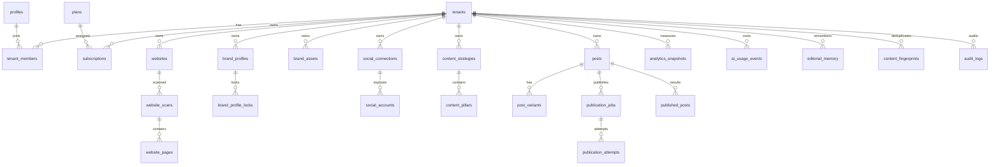

# Database

## ERD iniziale

## Sicurezza dati

- Tutte le tabelle tenant-scoped usano RLS.
- `service_role` non viene mai usata nel frontend.
- Credenziali social sono conservate in schema privato non esposto via PostgREST e solo come ciphertext; la cifratura applicativa/server-side viene implementata prima di attivare OAuth reale.
- `platform_admins` è nello schema privato e non modificabile da utenti applicativi.
- Audit log append-only lato applicativo privilegiato.

## Knowledge

Due livelli:
1. RAW: `website_pages`, asset, documenti e snapshot.
2. COMPACT: `brand_context_versions`, usato nella maggior parte delle generazioni.

## Publishing

`publication_jobs.idempotency_key` è unico per tenant. `published_posts` conserva ID esterno; il worker controlla entrambi prima di pubblicare.